# 📅 Evently App (Flutter)

A beautifully crafted Flutter app for browsing and discovering events, built with **Firebase** and
smooth UI transitions. It uses clean UI design principles and dynamic data rendering to deliver a
simple and intuitive user experience. The app supporting **English and Arabic** languages and also
supporting **Light Mode and Dark Mode**.

  

---

## 📱 Features

- 🚀 Clean and modern onboarding screens

- 📌 Event listings with images and detailed descriptions

- 🗺️ Google Maps integration for event locations

- 🔄 Custom navigation bar with smooth page transitions

- 🌐 The app supports both **English** and **Arabic** languages.

- 🌗 Light & dark theme support

- 📱 Responsive UI for different screen sizes

- 🔧 Built with clean code principles and reusable components

- 🔥 Depending on Firebase (Authentication + Storage)

---

## 📸 screenshots

### 🟦 Splash Screen

  
  

### 🎨 Onboarding Screens

  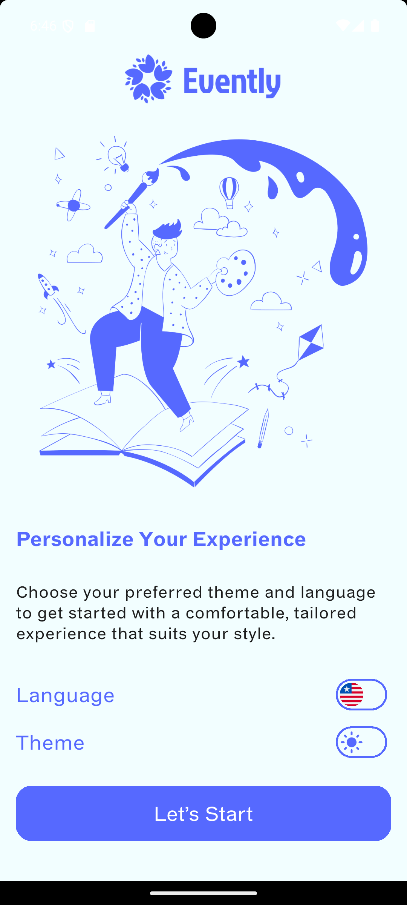
 

  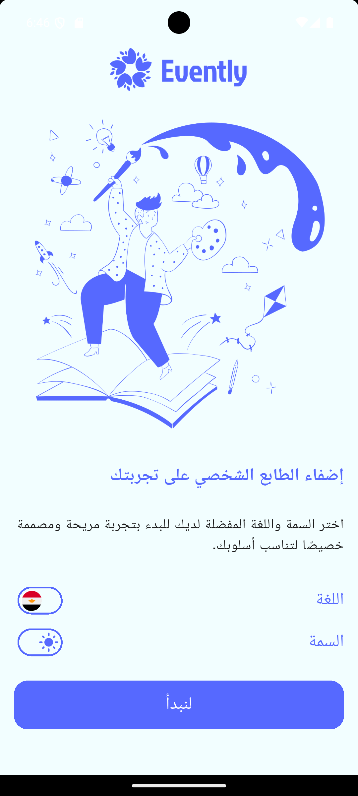
  

  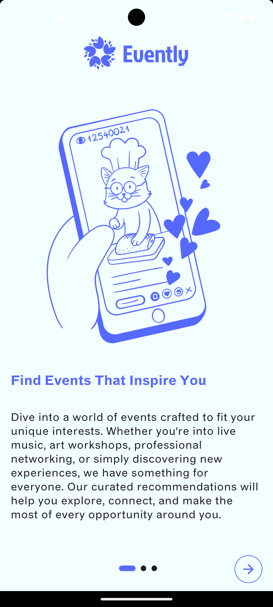
 

  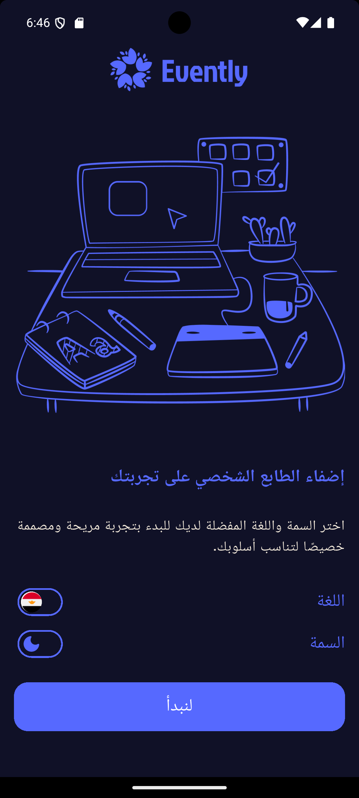
 

### 🔐 Authentication Screens

#### Sign In

  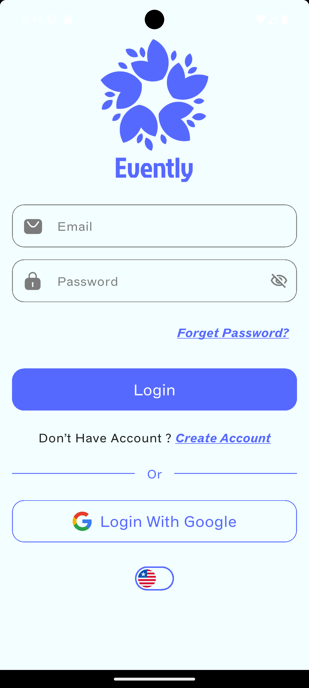
  

#### Sign Up

  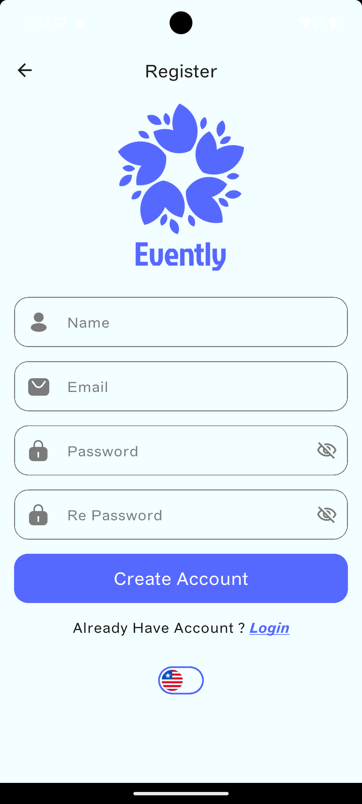
  

### 🏠 Home Screen

#### Home Tab

  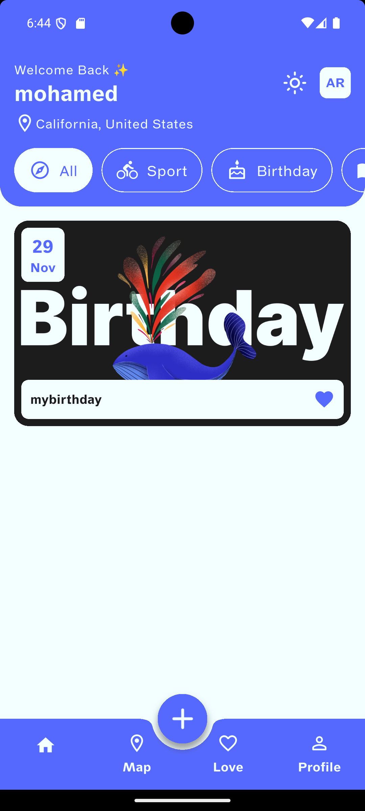

#### Favourite Tab

  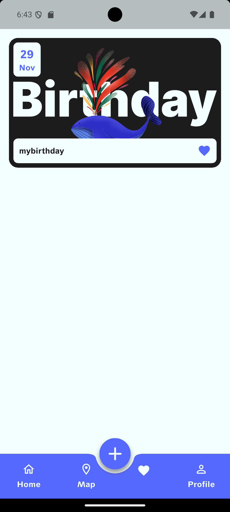
  

#### Profile Tab

  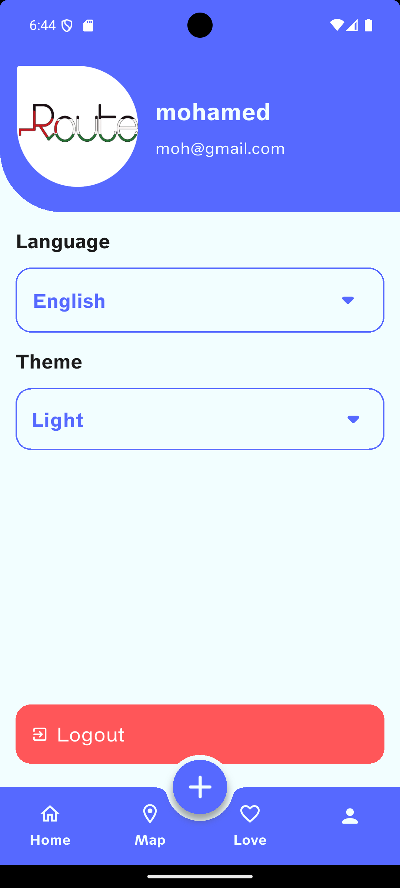

### 💭 Create Event

  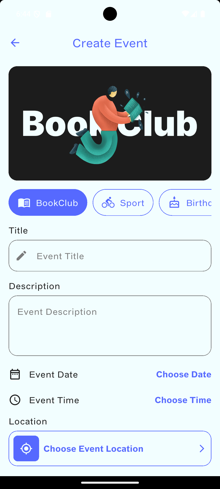
  

### ✨ Edit Event

  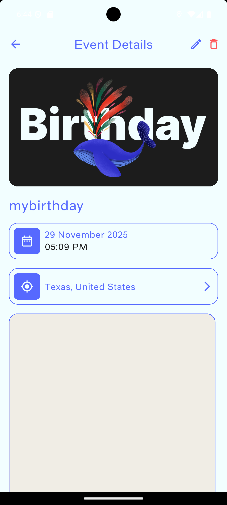
  

---

